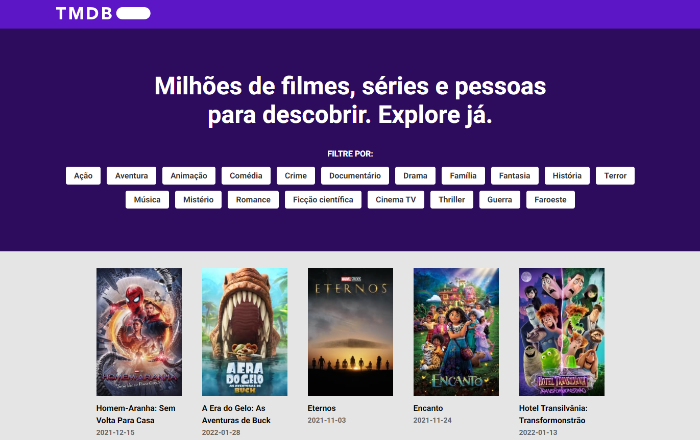

<p align="center">
  
</p>

<h1 align="center">
    
</h1>

<br>

## 🧪 Tecnologias

Esse projeto foi desenvolvido com as seguintes tecnologias:

- [React](https://reactjs.org)
- [TypeScript](https://www.typescriptlang.org/)
- [API The Movie DB](https://developers.themoviedb.org/3)

## 🚀 Como executar

Clone o projeto e acesse a pasta do mesmo.

```bash
$ git clone https://github.com/ggalli/The-Movie-Database
$ cd The-Movie-Database
```

Para iniciá-lo, siga os passos abaixo:
```bash
# Instalar as dependências
$ yarn

# Iniciar o projeto
$ yarn start
```
O app estará disponível no seu browser pelo endereço http://localhost:3000.

## 💻 Projeto

The Movie Database é um projeto de estudo onde é possível pesquisar pelos filmes mais populares do momento, filtrar por diversas categorias, visualizar informações relevantes, assistir ao trailer e etc.

## 🔖 Layout

Você pode visualizar o layout do projeto através do link abaixo:

- [Layout Web](https://www.figma.com/file/sKKCCdEa4lzBnslF8Z8jHy/Teste-Front-End-(Copy)?node-id=0%3A1) 

Lembrando que você precisa ter uma conta no [Figma](http://figma.com/).
